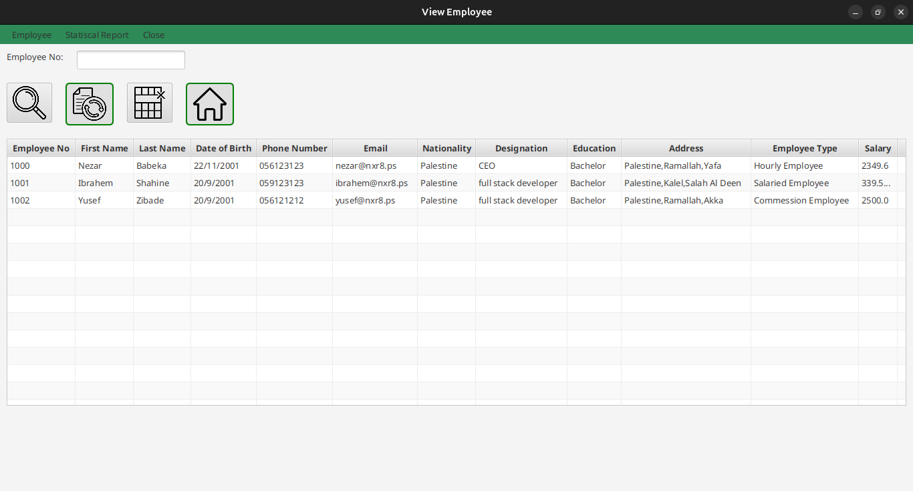

# Employee Management System

This project is an Employee Management System developed as part of the **COMP2311** course at **Birzeit University**. The system is designed to manage employee records, including their personal information, salary details, and employment type. The application is built using **JavaFX** for the graphical user interface (GUI).

## Features

- **Add Employees**: Add new employees with details such as name, date of birth, address, phone number, email, designation, education, and employment type (Hourly, Salaried, Commission-based, or Employee-based Commission).
  
- **View Employees**: View a list of all employees in a table format with sorting options by first name, last name, education, or salary.

- **Update Employees**: Modify existing employee details.

- **Delete Employees**: Remove employees from the system.

- **Search Employees**: Search for employees by their employee number.

- **Statistical Reports**: Generate reports such as total payments, maximum salary per employee type, and sorted employee lists.

- **File Operations**: Save employee data to a file and load employee data from a file.

## Technologies Used

- **Java**: The core programming language used for the application.
- **JavaFX**: Used for building the graphical user interface.
- **Maven**: For project dependency management.

## Project Structure

The project is structured as follows:

```
.
├── App.java
├── form
│   ├── Address.java
│   ├── CommessionEmployee.java
│   ├── ComparatorClasses
│   │   ├── EducationComparator.java
│   │   ├── FirstNameComparator.java
│   │   ├── LastNameComparator.java
│   │   └── PaymentComparator.java
│   ├── EmployeeBasedComession.java
│   ├── Employee.java
│   ├── HourlyEmployee.java
│   └── SalariedEmployee.java
└── GUI
    ├── AddEmployee.java
    ├── EmployeeRecordTab.java
    ├── EventHandlerCalsses
    │   ├── AddEmployeeButtonHandler.java
    │   ├── ReadEmployeeFromFileButtonHandler.java
    │   ├── RemoveEmployeeButtonHandler.java
    │   ├── SaveEmployeeToFileButtonHandler.java
    │   ├── TotalPaymentsButtonHandler.java
    │   └── UpdateEmployeeButtonHandler.java
    ├── MaxSalaryPerType.java
    ├── MyDatePicker.java
    ├── MyFileChooser.java
    ├── MyMenu.java
    ├── MyTabs.java
    ├── RemoveEmployee.java
    ├── SearchEmployee.java
    ├── SortedBy.java
    ├── StatiscalReportTab.java
    ├── UpdateEmployee.java
    └── ViewEmployee.java
```

## How to Run the Project

1. **Prerequisites**:
   - Ensure you have **Java JDK 11 or higher** installed.
   - Install **Maven** for dependency management.
   - Install **JavaFX** SDK.

2. **Clone the Repository**:

   ```bash
   git clone https://github.com/NXR8/BZU-NXR8/COMP2311/project-phase-2.git
   cd your-repo-name
   ```

3. **Build the Project**:

   ```bash
   mvn clean install
   ```

4. **Run the Application**:

   ```bash
   mvn javafx:run
   ```

5. **Using the Application**:
   - The application will open with a main window containing two tabs: **Employee Record** and **Statistical Report**.
   - Use the **Employee Record** tab to add, view, update, and delete employees.
   - Use the **Statistical Report** tab to generate reports and view sorted employee lists.

## Screenshots


*Main Window of the Employee Management System*


*Add Employee Form*


*View Employees Table*

## Contributing

Contributions are welcome! If you have any suggestions or improvements, feel free to open an issue or submit a pull request.

## License

This project is licensed under the MIT License. See the [LICENSE](LICENSE) file for details.

## Acknowledgments

- **Birzeit University** for providing the course material and guidance.
- **JavaFX** for the powerful GUI framework.
- **Maven** for simplifying dependency management.

---

**Note**: This project was developed as part of the **COMP2311** course at **Birzeit University**.
